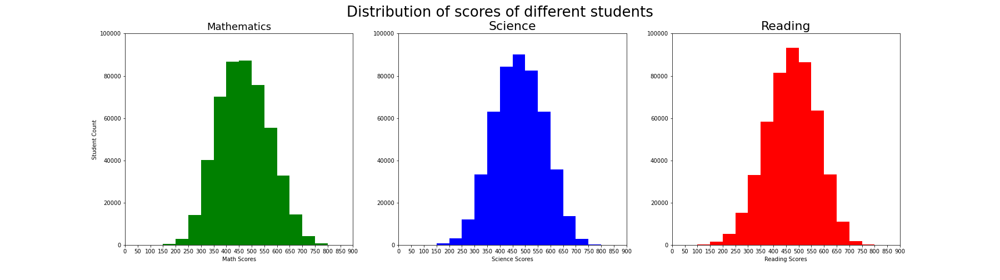
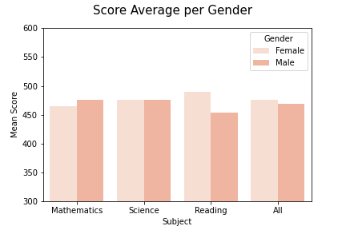
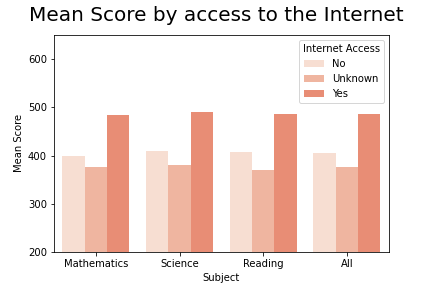

#  FWD Udacity Data Analysis Nanodegree
## Communicate Data Findings: PISA 2012


***

## Content
- [Project and dataset description](#desc)
- [Investigation](#investigation)
- [Key Questions](#questions)
- [Data Analysis](#analysis)
- [Univariate Exploration and Analysis](#univariate)
- [Conclusion](#conclusion)

<a id='desc'></a>
## Project and dataset description

### What is the Pisa Programme?

"The Programme for International Student Assessment (PISA) is an international survey which aims to evaluate education systems worldwide by testing the skills and knowledge of 15-year-old students who are nearing the end of their compulsory education in the key subjects: reading, mathematics and science.This survey gives us insights into how the students' background and school environment could influence their performance."
  
Source: [Pisa Programme Description](http://www.oecd.org/pisa/aboutpisa/ "OECD Homepage")


### Pisa 2012

"PISA 2012 is the programme’s 5th survey. 
* It assessed the competencies of 15-year-olds in reading, mathematics and science.
* covered 65 countries and economies. 
* surveyed 510 000 students.
* age group [15 years and 3 months :  16 years 2 months] 
  
Source: [Pisa 2012 Survey Description](http://www.oecd.org/pisa/aboutpisa/pisa-2012-results.htm "OECD Homepage")

***

<a id='investigation'></a>
## Investigation

Let us first just see random 10 rows of the dataset to get a quick glance.


```python
# import libraries
import pandas as pd
import matplotlib.pyplot as plt 
from scipy.stats import pearsonr
%matplotlib inline
import numpy as np
import seaborn as sns 

# due to the large number of columns [>600], we made a limit of 700 columns in order to capture all of them
pd.set_option('display.max_rows', 700)
pd.set_option('display.max_columns', 700)

# let's import the dataset
pisa_2012 = pd.read_csv(r"C:\Users\nahla\Downloads\Nanodegree Deadline\pisa data\pisa2012.csv",encoding='latin-1', low_memory = False)


#import the column descriptions accordingly
pisa_2012_dict = pd.read_csv(r"C:\Users\nahla\Downloads\Nanodegree Deadline\pisa data\pisadict2012.csv", 
                        encoding='latin-1', low_memory = False)
                        
# to download the data on your device please use this link: 

1. https://s3.amazonaws.com/udacity-hosted-downloads/ud507/pisa2012.csv.zip 
2. https://s3.amazonaws.com/udacity-hosted-downloads/ud507/pisadict2012.csv
```


<a id='questions'></a>
## Key Questions
 
* performance of the students on different subjects (Math, Reading and Science)? 
* calculate the score for each subject and student[based on the mean value of the computed values (1 to 5)]
* Does country has an impact on the students performance?
* Does Gender has an impact on the results?
* Does the internet performance has an impacat on the students results?


<a id='analysis'></a>
## Data Analysis output

<a id='univariate'></a>
### Univariate

we analyzed the data using Univariate analysis


###### a. over all results



We see the following things:
  
* the score median between 300 and 600,
* the sores are normally distributed.


###### b. gender impact


there is a limited gender gap in all subjects excepts for Reading where females into reading more than males. 


###### c. internet access impact

  
this is very clear the better internet access to the students, more grades they get on their exams.

***


<a id='conclusion'></a>
### Conclusion
  
* We have found that the scores in each of the subjects seem to be normally distributed. The major part of the students gets a score between 300 and 600. There is no difference to see between the subjects (median values not significantly different).
    
* countries out of 10 in the top-10 country list are in Asia. The other 3 countries are European countries. China-Shanghai is in the top spot for all of the subjects and therefore also tops the overall rankings. The opposite is the case for Peru that ranks last in all of the categories.
    
* there is a limited gender gap in all subjects excepts for Reading where females into reading more than males.however, Male students seem to be slightly better in Mathematics though while for the subject Science it seems to be very balanced. The overall performance of female students still seems to be better than the one from male students._
  
* this is very clear the better internet access to the students, more grades they get on their exams.
